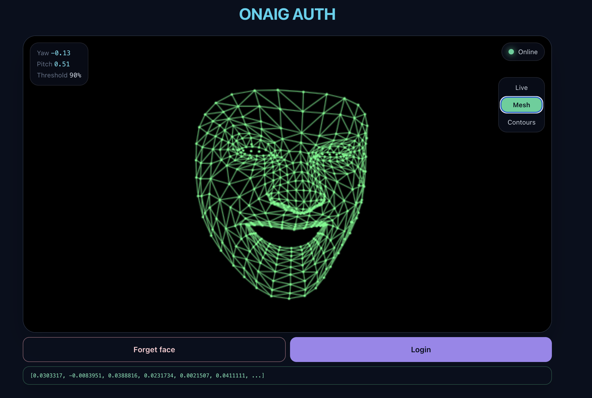

# ONAIG

## Passkey authentication and EVM transactions

Giano (reverse). Passkey authentication for the blockchain:  
- Live demo here: https://onaig-passkey.duckdns.org
- Code here: [./packages/0-passkey](./packages/0-passkey) 


## Faceonly authentication

Do you want to try something cool? **Mobile-ready face authentication**, 
powered by the ONXX runtime and GhostFaceNets models.
Don't worry: your face is not sent anywhere and not stored anywhere!  
The demo runs completely in the browser.  

Try the demo here: https://onaig-faceonly.duckdns.org



## Development

Setup:
```sh
fnm install
npm install -g corepack
corepack enable
corepack install
pnpm install
```

Linting:
```sh
pnpm lint # lint
pnpm tsc # typecheck
```

Testing:
```sh
pnpm -r test
```