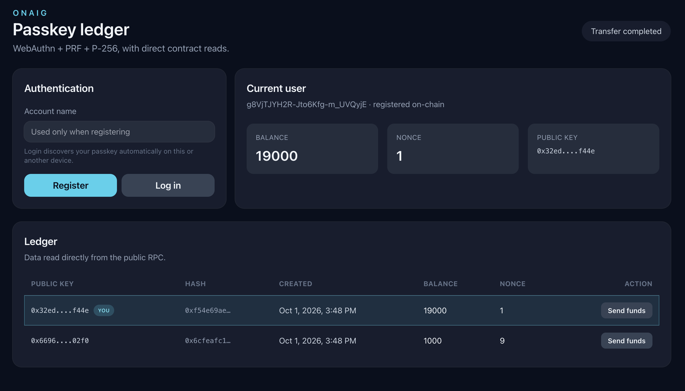

# ONAIG

Giano (reverse). Passkey authentication for blockchain:  
- Live demo here: https://onaig-passkey.duckdns.org  
- Code here: [./packages/0-passkey](./packages/0-passkey) 



## Development

Setup:
```sh
fnm install
npm install -g corepack
corepack enable
corepack install
pnpm install
```

Linting:
```sh
pnpm lint # lint
pnpm tsc # typecheck
```

Testing:
```sh
pnpm -r test
```